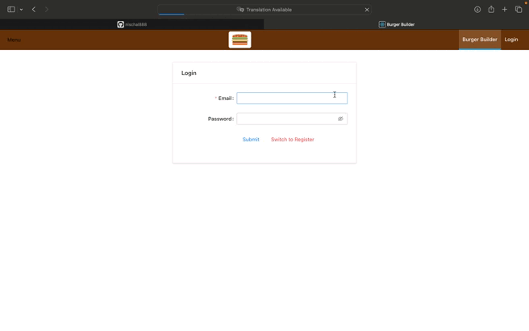

##This is a simple web application where you can customize and order your own burgers by adding your favorite ingredients. The app is built using React.js on the frontend and Firebase on the backend.

##Technologies Used

Frontend: React.js, Redux, Redux Saga
Backend: Firebase

## Getting Started

To run this project locally, follow these steps:

Getting Started

### Clone the repository:

git clone https://github.com/nischal888/burger-app.git

### Navigate to the project directory:

cd small-burger-app

### Install dependencies:

npm install

### Set up Firebase:

Create a Firebase project on the Firebase Console.
Obtain your Firebase configuration.
Create a .env file in the project root and add your Firebase configuration:

### Run the app:

npm start

